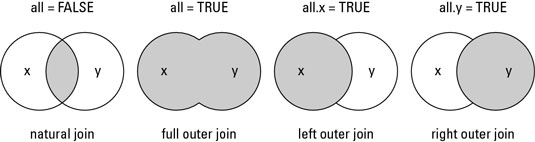

```{r echo = FALSE}
knitr::opts_chunk$set(comment = NA)
```


***

# Introduction

Fusionner des jeux de données par association signifie :

> mettre en commun des observations de certaines variables en associant correctement les observations selon leurs unités de provenance.
 
Pour faire une fusion par association entre deux jeux de données, les conditions suivantes doivent être satisfaites :

- les deux jeux de données doivent *contenir la ou les variables permettant d'identifier les unités*;
- les valeurs de ces variables doivent avoir le *même format* dans les deux jeux de données.


## Exemple en R

Supposons que nous avons les deux jeux de données suivants :
```{r}
x <- data.frame(ID = c("A", "A", "B", "D"), Age = c(21, 21, 32, 43))
x
y <- data.frame(ID = c("B", "C", "E"), Sexe = c("F", "H", "H"))
y
```

En R, les deux jeux de données peuvent être juxtaposés avec la fonction `merge`, en utilisant la variable `ID` comme identifiant des unités, comme suit :
```{r}
merge(x, y)
```

En fait, cette commande est équivalente à la commande suivante :
```{r, results = 'hide'}
merge(x, y, by = "ID")
```

car la fonction `merge` utilise par défaut les colonnes portant les mêmes
noms pour identifier les unités (donc pour faire l'association entre les lignes des deux fichiers).\
Si les variables identifiant les unités ne portent pas les mêmes noms dans les deux jeux de données, il faut spécifier des valeurs pour les arguments `by.y` et `by.x`, comme suit :
```{r, results = 'hide'}
merge(x, y, by.x="ID", by.y="ID")
```


# Types de fusion par association

Par défaut, la fonction `merge` conserve uniquement les unités communes aux deux jeux de données. Il est possible de demander à la fonction `merge` de conserver toutes les unités :
```{r}
merge(x, y, all = TRUE)
```
ou seulement les unités présentes dans le premier jeu de données (`x`) :
```{r}
merge(x, y, all.x = TRUE, all.y = FALSE)
```
ou seulement les unités présentes dans le deuxième jeu de données (`y`) :
```{r}
merge(x, y, all.x = FALSE, all.y = TRUE)
```


Les différents types de fusion par association sont illustrés dans la figure suivante :

```{r, echo = FALSE, out.width = "60%", fig.align = 'center'}

```

**Source** : <http://www.datasciencemadesimple.com/join-in-r-merge-in-r/>

\ 

Pour plus d'informations sur la fonction `merge`, vous pouvez aller voir la fiche d'aide de la fonction en tapant [`help(merge)`](https://stat.ethz.ch/R-manual/R-devel/library/base/html/merge.html) dans la console R.

***

<!--
C'est la fin.
-->

