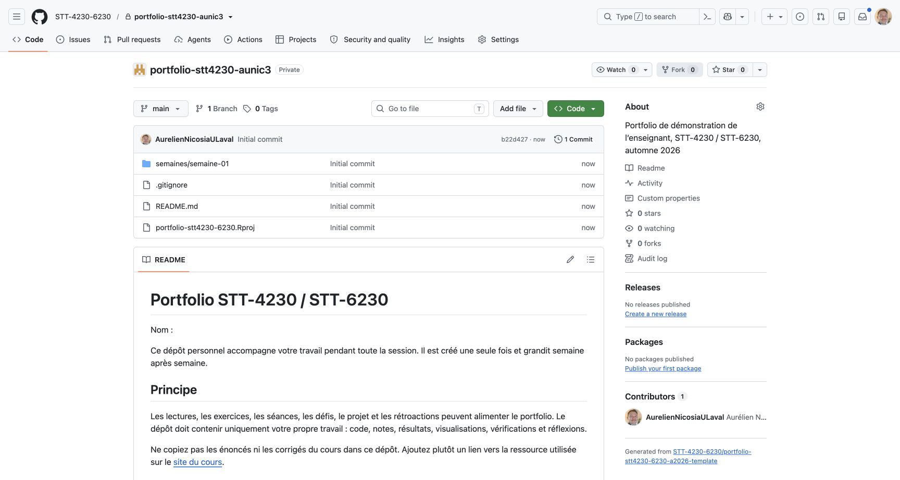
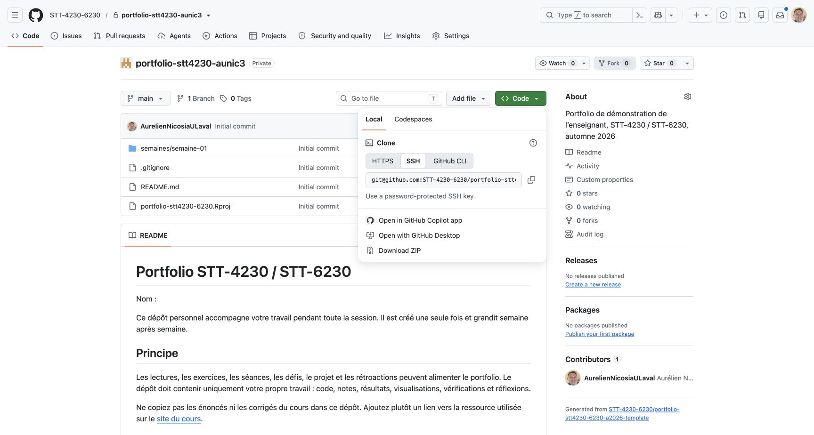
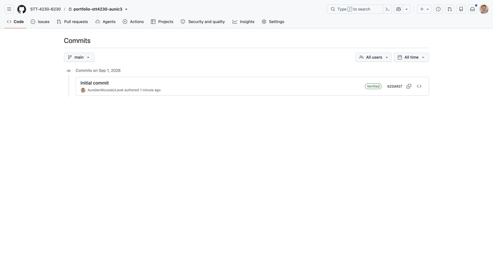

## {#bienvenue .title-slide background-color="#f7fafb"}

STT-4230 / STT-6230 · Automne 2026

<h1>Programmer pour livrer de la science des données.</h1>

R, données, rapports, tests, collaboration et jugement professionnel.

Aurélien Nicosia · Université Laval

  

  

  

  
R

  
Git

  
Q

  
data

  
<strong>STT</strong>4230 / 6230

::: {.notes}
Ouvrir sur la promesse du cours, pas sur les détails administratifs. Demander: « À quoi ressemble un projet de science des données que vous seriez fier de montrer? »

Sources internes: index.qmd; plan-cours.qmd.
:::

## Ce cours ne vise pas le code qui fonctionne une fois {.statement-slide}

Il vise le travail qu'une autre personne peut relancer, comprendre et utiliser.

  
01<h3>Reproductible</h3>
Un projet qui se relance sans bricolage caché.

  
02<h3>Explicable</h3>
Des choix, résultats et limites que vous pouvez défendre.

  
03<h3>Livrable</h3>
Une production claire pour un vrai public.

::: {.notes}
Faire le lien avec le futur portfolio: le cours produit des preuves de compétences, pas seulement des réponses d'exercices.

Source interne: objectif général, plan-cours.qmd.
:::

## Votre pratique va couvrir tout le cycle du travail

01<h3>Structurer</h3>
un projet, un dépôt, des conventions et des dépendances.

02<h3>Fiabiliser</h3>
les données, le code, les tests et les chemins de reproduction.

03<h3>Communiquer</h3>
avec des figures, rapports Quarto et documentation utile.

04<h3>Améliorer</h3>
la performance, l'architecture et la maintenabilité du travail.

05<h3>Collaborer</h3>
avec GitHub, issues, revue de code et traces de contribution.

06<h3>Décider</h3>
quand utiliser l'IA, comment la vérifier et quoi en déclarer.

La programmation est ici un moyen de produire une analyse fiable et communicable.

::: {.notes}
La liste reprend les objectifs spécifiques, sans les lire comme une liste d'administration. Insister sur le fait que les techniques se répondent dans le projet filé.

Source interne: plan-cours.qmd.
:::

## À la fin, vous aurez des preuves visibles de votre travail

dépôts GitHub
données validées
rapports Quarto
fonctions testées
figures utiles
projet d'équipe
revues de code
journal IA
site personnel

Chaque production devient une trace: elle montre ce que vous avez conçu, vérifié, amélioré ou expliqué.

::: {.notes}
Ce ne sont pas neuf livrables isolés. Le portfolio rassemble les traces qui reviennent dans le projet et le site personnel.

Sources internes: evaluations.qmd; portfolio.qmd; projets.qmd; site-personnel.qmd.
:::

## Votre point de départ: des bases de R et un atelier prêt

Une connaissance minimale de R est attendue.

Le cours part des bases utiles de R, puis progresse vers les données, les graphiques, les rapports et le code durable.

<strong>Avant la première séance:</strong> faites l'autodiagnostic R. Utilisez le parcours de mise à niveau si une base manque.

  
R
analyser

  
P
Positron ou RStudio

  
Q
rendre avec Quarto

  
G
versionner avec Git et GitHub

::: {.notes}
Ne pas décourager les personnes qui ont des bases inégales. La mise à niveau est une voie explicite, mais elle doit être engagée tout de suite. Rappeler que GitHub en SSH est privilégié lorsque possible.

Sources internes: plan-cours.qmd; demarrage.qmd; soutien-technique.qmd.
:::

## Une semaine se vit en trois temps

Avant<h3>Préparer</h3>
Lire, exécuter les exemples, préparer le dépôt et noter ce qui bloque.
<small>Mini-test dans Brio lorsqu'il est prévu.</small>

→

Pendant<h3>Construire</h3>
Clarifier, coder, tester, discuter et demander de l'aide avec un exemple reproductible.
<small>Le laboratoire est un atelier.</small>

→

Après<h3>Stabiliser</h3>
Rendre, vérifier, documenter et ajouter une trace au portfolio.
<small>Le travail devient réutilisable.</small>

9 mini-tests · ouverture le mercredi à 16 h 20 · fermeture le mardi à 23 h 59 · 10 minutes au plus · une seule tentative

::: {.notes}
Le rituel est plus important que la charge apparente: préparation légère, mise en pratique accompagnée, puis une trace stable. La consigne active est toujours celle affichée dans Brio.

Sources internes: index.qmd; calendrier.qmd; evaluations.qmd; demarrage.qmd.
:::

## Le laboratoire est un lieu pour expérimenter, pas pour rester bloqué seul

Vous arrivez avec une question, un exemple ou une première hypothèse.

01
Clarifier l'objectif et la consigne.

02
Essayer par petites étapes dans le bon projet.

03
Vérifier un résultat, une figure ou un test.

04
Conserver une trace nette avant de repartir.

L'aide est plus efficace quand elle part d'un exemple minimal reproductible.

::: {.notes}
Présenter le labo comme un espace où demander de l'aide est une bonne pratique professionnelle. Cela prépare la diapositive sur les canaux de soutien.

Sources internes: communication.qmd; soutien-technique.qmd.
:::

## Quatre espaces, quatre rôles complémentaires

Site du cours<h3>Apprendre</h3>
Modules, lectures, laboratoires, gabarits et ressources.

Brio<h3>Confirmer</h3>
Annonces, consignes finales, remises, dates et modalités officielles.

GitHub<h3>Tracer</h3>
Versions, issues, revue de code, dépôts et contributions.

Équipe enseignante<h3>Débloquer</h3>
Concepts, choix techniques, diagnostic et rétroaction.

En cas de différence, une consigne officielle dans Brio ou une annonce explicite de l'équipe enseignante prévaut.

::: {.notes}
Préciser que GitHub est une trace de travail et non un remplacement de l'espace institutionnel. Les canaux et disponibilités détaillés sont communiqués dans l'espace institutionnel.

Source interne: communication.qmd.
:::

## Le parcours de la session: une montée en puissance

Semaines 1 à 4<h3>Prendre R en main</h3>
R, fichiers, calculs, données et prétraitement.

Semaines 5 à 8<h3>Faire parler les données</h3>
Défi 1, graphiques, bonnes pratiques, rapports et défi 2.

Semaines 9 à 13<h3>Rendre le code durable</h3>
Contrôle, fonctions, tests, objets, performance et défi 3.

Semaines 14 et 15<h3>Publier et défendre</h3>
Bilan, projet, site personnel, démonstration et revue.

Les défis font des points d'étape. Le projet et le portfolio donnent une direction à tout le parcours.

::: {.notes}
Cette vue donne l'architecture pédagogique avant de présenter les semaines une à une.

Source interne: plan-cours.qmd; calendrier.qmd.
:::

## 1 à 5 · Prendre R en main et apprendre à regarder les données {.phase-slide}

S1<h3>Mise en route</h3>
Présentation, prise en main de R et GitHub, première trace.

S2<h3>Bases de R</h3>
Structures de données et fichiers.

S3<h3>Calculs en R</h3>
Calculs mathématiques et statistiques.

S4<h3>Prétraiter</h3>
Préparer les données avant de les analyser.

S5<h3>Défi 1</h3>
Défi individuel, puis première exploration graphique, sans IA.

Objectif: manipuler des données en R et en garder une trace personnelle compréhensible.

::: {.notes}
Nommer le défi comme une vérification de bases, pas un examen qui arrive sans préparation. Après la remise, l'atelier de consolidation porte sur un cas analogue et ne modifie pas le livrable évalué.

Source interne: calendrier.qmd; evaluations.qmd.
:::

## 6 à 10 · Visualiser, rapporter et construire de bonnes habitudes {.phase-slide}

S6<h3>Graphiques et rapports</h3>
Figures, bonnes pratiques et introduction aux rapports reproductibles.

S7<h3>Bien rédiger</h3>
Bonnes pratiques, R Markdown et transition vers Quarto.

S8<h3>Défi 2</h3>
Défi individuel, IA permise et déclarée, puis consolidation.

S9<h3>Contrôle et fonctions</h3>
Conditions, boucles et premières fonctions.

S10<h3>Tests et débogage</h3>
Fonctions, exceptions et correction d'erreurs.

Objectif: passer d'un résultat obtenu à une figure ou un rapport que l'on peut expliquer et améliorer.

::: {.notes}
Mentionner la semaine de lecture du 26 au 30 octobre, sans séance le mercredi 28 octobre, entre les semaines 8 et 9.

Source interne: calendrier.qmd.
:::

## 11 à 15 · Développer, optimiser et conclure {.phase-slide}

S11<h3>Objets en R</h3>
Programmation orientée objet.

S12<h3>Performance</h3>
Mesure, optimisation et introduction à la métaprogrammation.

S13<h3>Défi 3</h3>
IA intégrée, puis organisation minimale d'un package R.

S14<h3>Récapitulatif et défense</h3>
Reproduction, conclusion, finalisation et défense du projet.

S15<h3>Remise du site</h3>
Publication et remise du site Quarto personnel.

Objectif: livrer un projet reproductible, documenté et expliqué avec lucidité.

::: {.notes}
La défense du projet a lieu pendant le cours régulier de S14, le mercredi 9 décembre. La seule remise de S15 est le site Quarto personnel, le mercredi 16 décembre à 23 h 55.

Source interne: calendrier.qmd; presentation.qmd.
:::

## L'évaluation accompagne cette progression

<strong>10 %</strong>Mini-tests

<strong>20 %</strong>Portfolio GitHub

<strong>30 %</strong>Projet filé

<strong>30 %</strong>3 défis de 10 %

<strong>10 %</strong>Site Quarto

<strong>9 mini-tests</strong> préparer et vérifier

<strong>3 jalons</strong> 4, 6 et 10 points

<strong>3 jalons</strong> semaines 6, 12 et 14

<strong>3 défis</strong> semaines 5, 8 et 13

<strong>Publication</strong> semaine 15

::: {.notes}
La note n'est pas concentrée dans une seule épreuve. Montrer que les composantes se soutiennent: les mini-tests préparent, le portfolio documente, les défis vérifient et le projet intègre.

Source interne: evaluations.qmd; calendrier.qmd.
:::

## Trois défis, trois manières de montrer votre autonomie

Défi 1 · 10 %<h3>Faire seul</h3>
Structure de projet, Git, importation, nettoyage simple et README.
<small>IA non permise</small>

Défi 2 · 10 %<h3>Faire avec une aide transparente</h3>
Pipeline simple, visualisation et rapport Quarto court.
<small>IA permise, déclarée</small>

Défi 3 · 10 %<h3>Faire preuve de jugement</h3>
Diagnostic, amélioration et validation d'un mini-projet.
<small>IA intégrée et vérifiée</small>

Les ateliers de consolidation qui suivent les défis sont des moments d'apprentissage non évalués.

::: {.notes}
La règle IA devient progressivement un objet d'apprentissage. Bien distinguer « IA permise » de « code non vérifié accepté »: le travail doit toujours être compris et défendable.

Source interne: evaluations.qmd; ia.qmd.
:::

## Le portfolio GitHub rend votre progression visible

Votre portfolio ne montre pas seulement le résultat final.

Il montre <strong>comment</strong> vous avez appris à le produire.

Code
scripts, fonctions et tests

Décisions
README, conventions, notes et validations

Évolution
commits, corrections et revue

Réflexion
limites, apprentissages et usage d'IA déclaré

Jalon 1<strong>Semaine 3</strong>

Jalon 2<strong>Semaine 9</strong>

Jalon 3<strong>Semaine 14</strong>

::: {.notes}
Mentionner la routine minimale: une trace personnelle, au moins un fichier produit, une explication courte, une vérification ou une difficulté, puis des commits qui rendent la progression lisible. Cela aide à éviter le portfolio assemblé à la fin de la session.

Source interne: evaluations.qmd; portfolio.qmd.
:::

## Le projet filé transforme les techniques en produit collectif

S6<h3>Proposition</h3>
Question, données, risques et dépôt initial.

S12<h3>Version intermédiaire</h3>
Pipeline et produit partiellement fonctionnel.

S14<h3>Livraison et défense</h3>
Reproduction, limites, documentation, démonstration et questions.

Un dépôt clairUn produit démontrableDes traces individuellesUne équipe capable de l'expliquer

::: {.notes}
Le produit peut inclure un pipeline, un rapport, une application ou un tableau de bord. La forme exacte suit le problème choisi. La présentation et la revue de code font partie du projet de 30 %, elles ne constituent pas une composante distincte.

Sources internes: projets.qmd; presentation.qmd; evaluations.qmd.
:::

## Le site Quarto personnel rend une partie de votre travail publiable

<i></i><i></i><i></i>

Votre site<strong>Ce que je sais produire</strong>

Individuel · 10 % · mercredi 16 décembre, 23 h 55

<h3>Une vitrine courte, claire et vérifiable</h3>
<ul>
<li>Site publié avec Quarto et GitHub Pages</li>
<li>Dépôt source et dernier commit évalué</li>
<li>Au moins deux réalisations commentées</li>
<li>Une trace liée au portfolio</li>
<li>Usage de l'IA déclaré si pertinent</li>
</ul>

::: {.notes}
Le site ne remplace pas le portfolio ni la défense du projet. Il sélectionne une partie publiable du travail. Aucune information personnelle sensible n'est obligatoire.

Source interne: site-personnel.qmd; evaluations.qmd.
:::

## STT-6230 ajoute de la profondeur, pas une deuxième session

STT-4230
<h3>Livrer un travail solide</h3>
Fonctionnel, reproductible, structuré et documenté.

STT-6230
<h3>Justifier davantage</h3>
Ajouter, selon le livrable, une comparaison, des tests, une analyse de performance ou une note méthodologique.

Même parcours commun. Attentes d'approfondissement explicites dans les productions longues.

::: {.notes}
Éviter de présenter STT-6230 comme simplement « plus de code ». La différence porte sur la justification technique, la comparaison, les tests ou la note méthodologique adaptée au livrable.

Source interne: evaluations.qmd.
:::

## L'IA peut aider. Votre responsabilité demeure entière.

La règle simple
<h3>Vous pouvez utiliser l'IA si vous pouvez ensuite expliquer, vérifier, modifier et défendre ce qu'elle a aidé à produire.</h3>

Oui
Comprendre une erreur, obtenir un exemple, comparer des stratégies, relire ou générer des idées de tests.

Toujours
Tester localement, adapter au contexte, déclarer l'aide importante et protéger les données sensibles.

Un code ou une justification non compris n'est pas prêt à être remis, même s'il fonctionne.

::: {.notes}
Faire le lien avec les défis: non permise, permise et déclarée, puis intégrée. Les activités et modalités détaillées sont précisées dans les consignes d'évaluation.

Source interne: ia.qmd; evaluations.qmd.
:::

## L'IA du cours est construite à partir de sources vérifiées

01<h3>Contenu officiel</h3>
Pages Quarto, politique IA, évaluations, projet, portfolio et site personnel.

→

02<h3>Sélection versionnée</h3>
Les contenus publics approuvés sont regroupés avec leur source et leur empreinte numérique.

→

03<h3>Modes d'aide</h3>
Révision, exercices, rétroaction, débogage R, projet, sources et intégrité.

→

04<h3>Revue et tests</h3>
Fidélité aux sources, évaluations actives, confidentialité et gestion de l'incertitude.

Son contrat
Pour une règle propre au cours, le GPT cherche la source la plus précise. Si elle n'est pas vérifiable, il doit répondre: « Je ne sais pas. »

La mise à jour n'est pas automatique: une nouvelle version doit être préparée, chargée, revue et testée avant sa publication.

::: {.notes}
Présenter cette architecture comme une chaîne de responsabilité, pas comme une garantie que toute réponse sera exacte. Le site du cours et les consignes officielles demeurent les références. Une mise à jour du site ne modifie pas automatiquement le GPT: le paquet de connaissances doit être reconstruit, chargé dans le Builder, enregistré, puis vérifié après rechargement.

Sources internes vérifiées le 1er septembre 2026 dans le projet Pedagogical AI: `README.md`; `course-applications/stt-4230/course.yml`; `content.yml`; `sources.yml`; `gpt/agent-core-stt-4230.md`; `gpt/modes/`; `tests/critical-behavior.yml`; `deployment.yml`.
:::

## Pour obtenir de l'aide rapidement, rendez le problème visible

« Mon code ne fonctionne pas »
devient
« Voici l'objectif, le message d'erreur complet, un exemple minimal, mon commit et ce que j'ai déjà essayé. »

1Contexte et objectif

2Commande et message d'erreur

3Exemple minimal reproductible

4Résultat attendu et obtenu

5Ce qui a déjà été essayé

6Lien vers le commit ou le fichier

::: {.notes}
Cette façon de demander de l'aide vaut aussi dans un travail d'équipe et en contexte professionnel. Les canaux et disponibilités sont communiqués dans l'espace institutionnel.

Source interne: communication.qmd; soutien-technique.qmd.
:::

## Les grands repères de l'automne 2026

2 sept.<h3>Première séance</h3>
Mise en route et diagnostic initial.

28 oct.<h3>Pas de séance</h3>
Semaine de lecture.

9 déc.<h3>Dernière séance régulière</h3>
Synthèse, remise finale du projet, portfolio et défense.

16 déc. · 23 h 55<h3>Remise individuelle</h3>
Site Quarto personnel seulement.

Séances régulières: chaque mercredi, de 13 h 30 à 16 h 20, du 2 septembre au 9 décembre.

::: {.notes}
Les dates institutionnelles sont fournies à titre de repères. Pour toute remise ou modalité administrative, demander aux personnes étudiantes de vérifier Brio.

Sources internes: calendrier.qmd; plan-cours.qmd. Sources institutionnelles: fiche officielle STT-4230 et calendrier ULaval 2026-2027, cités dans ces pages.
:::

## Votre première séquence commence maintenant {.action-slide}

01<h3>Vérifier vos bases</h3>
Faire l'autodiagnostic R et choisir une cible de mise à niveau si nécessaire.

02<h3>Préparer l'atelier</h3>
R, Positron ou RStudio, Quarto, Git, GitHub et SSH lorsque possible.

03<h3>Créer une première trace</h3>
Cloner le dépôt attribué, compléter le README et documenter la semaine 1.

Prochaine séance · 9 septembre<strong>Bases de R, structures de données et fichiers</strong>
Lire la semaine 2 et terminer le mini-test 1 dans Brio avant le mardi 8 septembre à 23 h 59.

::: {.notes}
Faire réaliser les premières vérifications en classe si le temps le permet. Pour la prochaine séance, orienter vers le module 2 et la page Démarrage étudiant.

Sources internes: calendrier.qmd; demarrage.qmd.
:::

## 25 minutes pour vérifier vos bases en R {.diagnostic-activity-slide}

<strong>25</strong>minutes<small>Autodiagnostic R</small>

01<h3>Ouvrez l'autodiagnostic</h3>
<a href="diagnostic-r.html" target="_blank" rel="noopener">Autodiagnostic des bases de R</a>

02<h3>Répondez individuellement</h3>
Notez les notions à revoir et le premier blocage rencontré.

03<h3>Gardez votre bilan ouvert</h3>
Nous l'utiliserons pour choisir la bonne mise à niveau.

<strong>Pendant l'activité</strong>Je passe dans la classe pour vérifier votre environnement R et répondre aux blocages.

Un outil manque? Consultez <a href="installation.html" target="_blank" rel="noopener">Installation et vérification technique</a>.

::: {.notes}
Lancer un minuteur de 25 minutes et demander à tout le monde d'ouvrir l'autodiagnostic. Pendant l'activité, circuler dans la classe pour vérifier que R démarre, que la personne peut exécuter du code dans son éditeur et qu'elle conserve le message complet lorsqu'une erreur survient. Diriger les problèmes d'installation vers la page « Installation et vérification technique », sans commencer encore la configuration GitHub.

Après 20 minutes, annoncer qu'il reste 5 minutes. À la fin, demander à chacun de conserver son bilan et d'identifier une notion à revoir. Enchaîner ensuite avec le modèle mental Git et GitHub, puis la démonstration du portfolio.

Sources internes: diagnostic-r.qmd; demarrage.qmd; installation.qmd.
:::

## GitHub relie votre travail local à une trace visible {.github-demo-slide background-color="#eef8fc"}

::: {.github-mental-model}

  1
  <strong>Mon ordinateur</strong>
  <small>Je modifie et je vérifie les fichiers.</small>

  <strong>git push</strong>
  →
  <small>j'envoie mes commits</small>

  2
  <strong>GitHub</strong>
  <small>Je retrouve la copie distante et son historique.</small>

:::

::: {.github-one-sentence}
Git enregistre l'histoire sur l'ordinateur. GitHub rend cette histoire visible en ligne.
:::

::: {.notes}
Fixer ce modèle mental avant d'ouvrir l'interface. Insister sur le fait qu'un commit est local avant le push.
:::

## Voici le dépôt qui vous est attribué {.github-demo-slide}

::: {.github-screen-layout}

::: {.github-screen-frame}
{fig-alt="Page principale du portfolio de démonstration privé dans GitHub"}
:::

::: {.github-screen-legend}

1
<strong>Nom et visibilité</strong> Le bon dépôt, marqué Private.

2
<strong>Branche main</strong> L'état courant du projet.

3
<strong>Bouton Code</strong> Le point de départ du clonage.

4
<strong>Fichiers et README</strong> Le contenu et sa porte d'entrée.

:::

:::

::: {.notes}
Montrer rapidement le nom du dépôt, l'étiquette Private, la branche main, le bouton Code, la liste des fichiers et le README. Ne pas parcourir les onglets avancés à cette étape.

Source visuelle: capture de l'interface GitHub du dépôt privé de démonstration STT-4230-6230/portfolio-stt4230-aunic3, réalisée le 1er septembre 2026.
:::

## Le bouton Code donne l'adresse à cloner {.github-demo-slide}

::: {.github-screen-layout .github-screen-layout--clone}

::: {.github-screen-frame}
{fig-alt="Menu Code de GitHub avec l'option SSH sélectionnée"}
:::

::: {.github-screen-legend}

1
<strong>Local</strong> Nous voulons une copie sur l'ordinateur.

2
<strong>SSH</strong> La méthode privilégiée dans le cours.

3
<strong>Copier l'adresse</strong> Elle sera collée après <code>git clone</code>.

:::

:::

::: {.github-callout}
On clone le dépôt attribué. On ne crée pas un deuxième dépôt et on ne fait pas <code>git init</code>.
:::

::: {.notes}
Faire remarquer que le menu propose plusieurs méthodes. Sélectionner SSH et copier l'adresse. Le dépôt étudiant portera le sigle de son cours et son IDUL.

Source visuelle: capture du menu Code de GitHub dans le dépôt privé de démonstration, réalisée le 1er septembre 2026.
:::

## Cloner crée la copie locale du bon dépôt {.github-demo-slide}

::: {.github-clone-visual}

  GitHub
  
<code>portfolio-stt4230-IDUL</code><i>ou</i><code>portfolio-stt6230-IDUL</code>

  <small>le dépôt privé attribué selon votre inscription</small>

  ↓
  <code>git clone [adresse SSH copiée dans GitHub]</code>

  Ordinateur
  <strong>un nouveau dossier de projet</strong>
  <small>avec les fichiers et l'historique Git</small>

:::

::: {.github-callout .github-callout--soft}
Après le clonage, on ouvre ce dossier comme projet dans RStudio ou Positron.
:::

::: {.notes}
Remplacer verbalement IDUL par AUNIC3 pendant la démonstration de l'enseignant. Les personnes étudiantes utilisent le dépôt correspondant à leur inscription, STT-4230 ou STT-6230.
:::

## Le changement suit toujours le même cycle {.github-demo-slide}

::: {.github-cycle}

1<strong>Modifier</strong><small>Compléter le README</small>

2<strong>Vérifier</strong><small>Lire le changement</small>

3<strong>Committer</strong><small>Expliquer l'intention</small>

4<strong>Pousser</strong><small>Envoyer vers GitHub</small>

5<strong>Confirmer</strong><small>Voir la nouvelle trace</small>

:::

::: {.github-commit-message}
Message attendu
<code>Personnaliser le portfolio</code>
:::

::: {.notes}
Ne pas détailler toutes les commandes ici. Cette diapositive annonce simplement ce que la démonstration va rendre visible.
:::

## Un commit devient une ligne d'histoire {.github-demo-slide}

::: {.github-history-layout}

::: {.github-screen-frame}
{fig-alt="Historique GitHub du portfolio avant la démonstration"}
:::

::: {.github-history-points}

Message<strong>Quelle intention?</strong>

Auteur<strong>Qui a enregistré?</strong>

Identifiant<strong>Quel état précis?</strong>

:::

:::

::: {.github-callout .github-callout--success}
Après la démonstration, une deuxième ligne devra apparaître ici.
:::

::: {.notes}
L'historique contient seulement le commit initial avant la démonstration. Revenir à cette page après le push et montrer la nouvelle ligne.

Source visuelle: capture de l'historique GitHub du dépôt privé de démonstration, réalisée le 1er septembre 2026.
:::

## Regardez trois preuves pendant la démonstration {.github-demo-slide background-color="#0b4f6c"}

::: {.github-proof-grid}

01<strong>Le bon dépôt</strong>
Le nom contient le bon sigle et le bon IDUL.

02<strong>Le bon changement</strong>
Le README est personnalisé sans ajouter de fichier sensible.

03<strong>La nouvelle trace</strong>
Le commit apparaît sur GitHub après le push.

:::

::: {.github-demo-ready}
Démonstration réelle avec <code>portfolio-stt4230-aunic3</code>
:::

::: {.notes}
Passer maintenant au terminal ou à RStudio/Positron. Cloner le dépôt de démonstration, personnaliser le README, vérifier, committer, pousser, puis revenir à l'historique GitHub.
:::

## {#bienvenue-au-laboratoire .closing-slide background-color="#083d53"}

STT-4230 / STT-6230

<h2>Bienvenue dans l'atelier.</h2>

Cette session, vous allez transformer des idées, des données et du code en productions que vous pouvez expliquer avec confiance.

Soyez curieux. Soyez rigoureux. Gardez une trace.

<a href="https://aureliennicosiaulaval.github.io/programmation-pour-la-science-des-donnees/">aureliennicosiaulaval.github.io/programmation-pour-la-science-des-donnees</a>

::: {.notes}
Terminer avec une invitation à ouvrir le site, pas simplement avec « des questions? ». Garder quelques minutes pour les premiers blocages techniques.
:::
