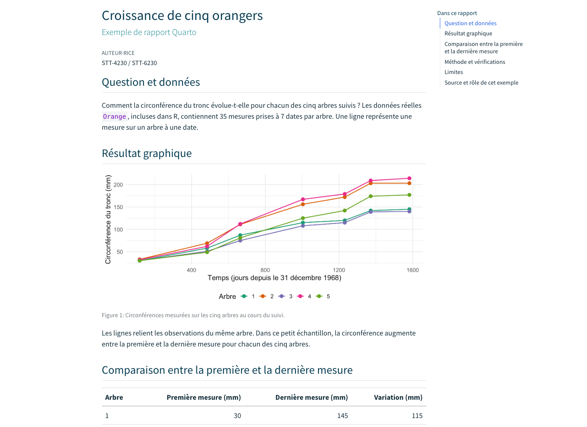
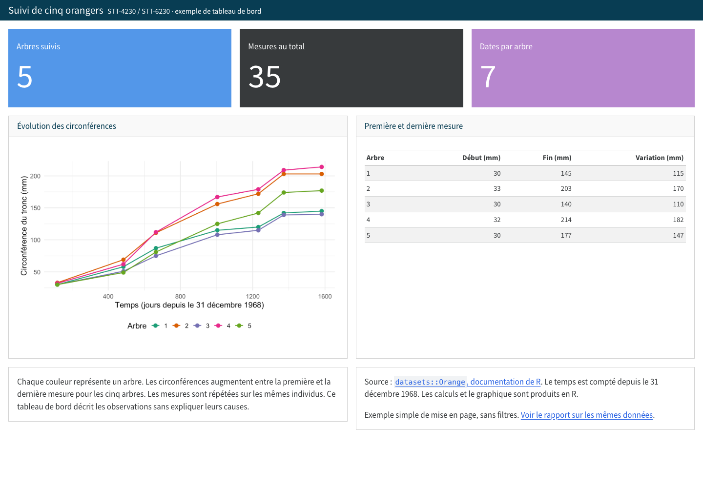
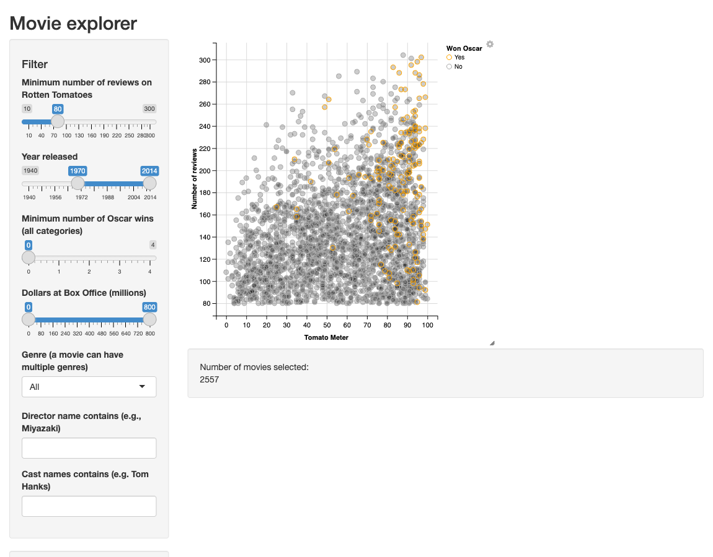
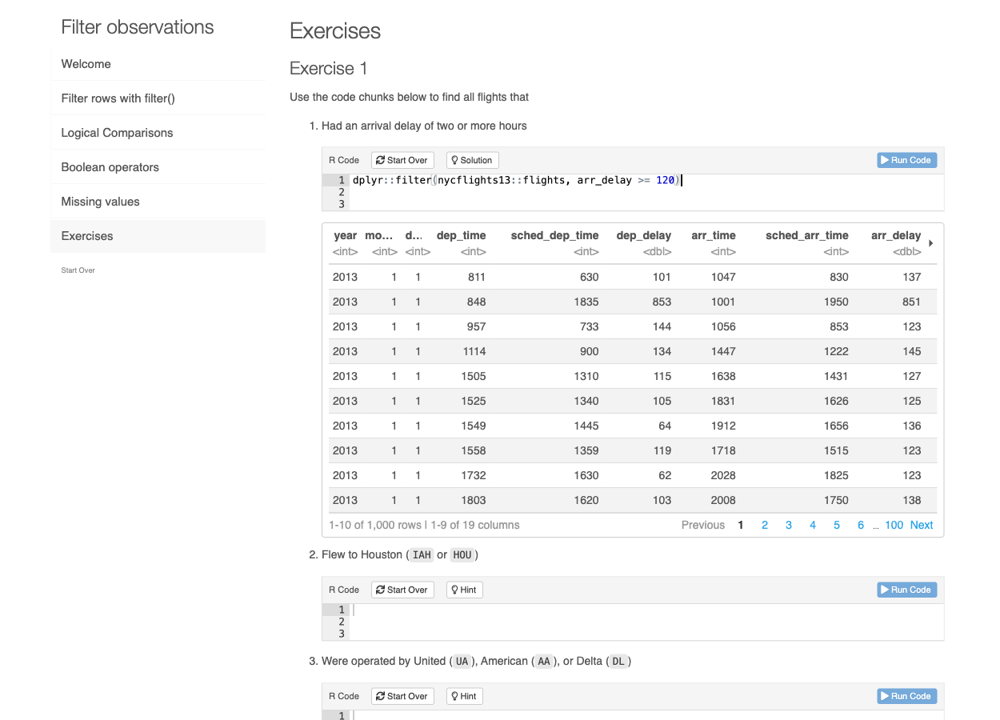

Le projet filé en équipe sert à intégrer les compétences du cours dans un produit de science des données plus complet. Il compte pour 30 % de la note finale.

L’IA est permise et déclarée. Le travail remis doit rester compris, vérifié, adapté au contexte et défendable par l’équipe.

Le projet est semi-dirigé. Les équipes choisissent un sujet et une source de données, mais le sujet doit être approuvé afin de garder les projets réalisables, comparables et compatibles avec les objectifs du cours.

Grille détaillée: [Grille d’évaluation du projet](gabarits/grille-projet.qmd).

## Modalités

| Élément | Modalité |
|---|---|
| Pondération | 30 % |
| Type | Équipe, avec traces individuelles |
| Taille d’équipe | 3 personnes par défaut; 2 ou 4 avec approbation |
| Remise | Dépôt GitHub d’équipe |
| Produit final | Format adapté à l’objectif : rapport, tableau de bord, application Shiny, tutoriel learnr, site pédagogique, outil R documenté ou autre produit approuvé |
| Jalons officiels | Semaines 6, 12 et 14 |
| IA | Permise, déclarée |

## Objectif du projet

Le projet doit transformer un jeu de données en produit reproductible de science des données. Le résultat attendu n’est pas seulement une analyse finale, mais un dépôt organisé qui montre comment les données ont été obtenues, nettoyées, analysées, validées, documentées et communiquées.

Le projet doit permettre de vérifier les compétences suivantes:

- structurer un dépôt R;
- documenter une source de données;
- importer, nettoyer et valider des données;
- produire des visualisations ou tableaux interprétables;
- construire un produit utilisable, adapté à un objectif d’analyse, d’exploration, d’apprentissage ou d’automatisation;
- utiliser GitHub pour collaborer;
- documenter les contributions individuelles;
- expliquer les limites du travail;
- déclarer et vérifier l’usage de l’IA lorsque pertinent.

## Exemples de produits finaux {#exemples-rendus}

Le format est ouvert. Choisissez-le selon ce que votre public doit pouvoir comprendre, explorer, apprendre ou réaliser. La liste ci-dessous donne des possibilités; elle n’est pas exhaustive. Le format et la portée du projet sont précisés dans la proposition et validés avec l’enseignant.

| Format possible | Exemple de projet à adapter à vos données |
|---|---|
| Rapport Quarto | Expliquer les variations saisonnières des précipitations avec des figures commentées |
| Tableau de bord | Réunir des indicateurs par station, une courbe temporelle et un tableau de synthèse |
| Application Shiny | Laisser le public choisir une station et une période pour recalculer les résumés et les graphiques |
| Tutoriel interactif learnr | Guider l’apprentissage du nettoyage de données avec du code R à compléter et des questions |
| Site pédagogique ou mini-livre Quarto | Organiser un parcours sur l’analyse de données en plusieurs pages avec des exemples reproductibles |
| Outil R documenté, éventuellement sous forme de petit package | Automatiser l’importation et la validation de fichiers, avec des fonctions testées et un exemple d’utilisation |
| Autre produit ou combinaison de formats | Proposer un simulateur, une carte interactive ou un autre outil répondant à un besoin précis |

Chaque format doit permettre de démontrer les compétences du cours : travail sur des données documentées, programmation en R, validation, reproductibilité, communication et collaboration. La complexité de l’interface ne constitue pas un objectif en soi.

Les deux rendus suivants illustrent seulement deux possibilités. Quarto est un outil qui transforme un fichier source `.qmd`, réunissant texte et code R, en un document consultable.

### Un rapport Quarto : expliquer une analyse

Un rapport se lit de haut en bas. Il présente la question, les données et la méthode, puis des figures ou tableaux commentés, une interprétation et les limites. Par exemple, un projet sur les précipitations pourrait expliquer leur évolution saisonnière à l’aide d’un graphique et d’un tableau de synthèse.

[Ouvrir l’exemple de rapport : croissance de cinq orangers](assets/documents/exemples-projet/rapport-orangers.html).

{width=85%}

### Un tableau de bord : consulter plusieurs vues

Un tableau de bord rassemble sur un même écran des indicateurs, des graphiques et des tableaux pour comparer ou suivre les données. Par exemple, un projet sur les précipitations pourrait réunir des totaux par station, une courbe mensuelle et un tableau récapitulatif. Des filtres peuvent être utiles, mais un tableau de bord simple peut aussi être statique.

[Ouvrir l’exemple de tableau de bord sur les mêmes orangers](assets/documents/exemples-projet/tableau-bord-orangers.html).

{width=100%}

Les deux exemples utilisent les mêmes données réelles, `datasets::Orange`, pour illustrer la différence de présentation. Ce sont des exemples de formats, pas des projets complets à reproduire. Les exigences de provenance, de nettoyage, de validation, de collaboration et de documentation s’appliquent au format retenu. L’équipe peut retenir un autre format ou en combiner plusieurs si cela répond à son objectif.

### Une application Shiny : explorer ou agir

Une application Shiny propose une interface dont les commandes déclenchent des calculs en R. Par exemple, le public choisit une station et une période, puis consulte les graphiques et les résumés correspondants. Un simulateur pédagogique ou un outil d’exploration sont aussi possibles.

[Essayer Movie explorer](https://gallery.shinyapps.io/051-movie-explorer/) : cette application permet de filtrer un catalogue de films et de choisir les variables représentées. L’aperçu ci-dessous montre l’interface réelle de cette démonstration externe en anglais.

{width=100%}

Source : [galerie Shiny de Posit, Movie explorer](https://shiny.posit.co/r/gallery/interactive-visualizations/movie-explorer/) et [code de l’exemple](https://github.com/rstudio/shiny-examples/tree/master/051-movie-explorer). Capture du 30 septembre 2026.

### Un tutoriel learnr : apprendre en pratiquant

Un tutoriel learnr associe des explications, des exercices de code R exécutables dans le navigateur et des questions. Par exemple, votre équipe pourrait concevoir un parcours qui fait importer des données, repérer des valeurs manquantes, nettoyer les observations et interpréter un graphique. Les objectifs d’apprentissage, les exercices et les résultats attendus doivent être explicites.

[Essayer Filter observations](https://learnr-examples.shinyapps.io/ex-data-filter/#section-exercises) : ce tutoriel fait pratiquer le filtrage de données de vols. L’aperçu montre une consigne, le code saisi puis exécuté dans le navigateur et son résultat. Le tutoriel externe est en anglais.

{width=100%}

Source : [exemples officiels learnr](https://rstudio.github.io/learnr/#examples) et [source R Markdown du tutoriel](https://github.com/rstudio/learnr/tree/main/inst/tutorials/ex-data-filter/ex-data-filter.Rmd). Capture du 30 septembre 2026.

learnr s’appuie sur R Markdown; un projet de ce type n’a donc pas à être converti en Quarto.

### Un site pédagogique ou un outil R : transmettre ou automatiser

Un site ou un mini-livre peut organiser un parcours en plusieurs pages, avec des explications et des analyses reproductibles. Un outil R peut prendre la forme de fonctions documentées, éventuellement regroupées dans un petit package, qui automatisent une tâche sur des données. Dans les deux cas, les exemples d’utilisation et les validations doivent permettre de comprendre ce que le produit apporte et de vérifier son fonctionnement.

### Ce qu’on attend dans la proposition du 7 octobre

À ce stade, nommez le format envisagé, le public visé et ce que ce public pourra y voir, y faire ou y apprendre. Vous n’avez pas encore à livrer le produit fonctionnel, ni à maîtriser l’outil retenu.

Exemple de formulation : « Nous prévoyons un rapport Quarto présentant les précipitations par saison et par station, avec un graphique commenté, un tableau de synthèse et une discussion des limites. » Autre exemple : « Nous prévoyons un tutoriel learnr qui guide des débutants dans le nettoyage de données de précipitations, avec des exercices de code et des questions d’interprétation. » Ces formulations doivent être adaptées à une source dont vous avez vérifié les variables.

Sources pour les fonctionnalités : documentation de Quarto ([rapports HTML](https://quarto.org/docs/output-formats/html-basics.html), [tableaux de bord](https://quarto.org/docs/dashboards/)); Posit, [Shiny pour R](https://shiny.posit.co/r/getstarted/shiny-basics/lesson1/); équipe learnr, [tutoriels interactifs](https://rstudio.github.io/learnr/). Pages consultées le 30 septembre 2026.

## Choix du sujet

Chaque équipe choisit un sujet à partir d’une source de données publique, fictive ou explicitement autorisée. Les règles de provenance, de licence et de confidentialité sont précisées dans [Données autorisées](donnees.qmd).

Les données doivent être suffisamment riches pour permettre:

- une étape de nettoyage;
- une exploration descriptive;
- au moins une visualisation utile;
- une validation ou un test;
- une interprétation des limites;
- une amélioration progressive entre les jalons.

Les sources de données suivantes sont recommandées comme points de départ:

| Source | Usage possible |
|---|---|
| [Données Québec](https://www.donneesquebec.ca/) | Données publiques québécoises, municipales ou gouvernementales |
| [Gouvernement ouvert du Canada](https://rechercher.ouvert.canada.ca/data/) | Données publiques fédérales |
| [Statistique Canada](https://www.statcan.gc.ca/) | Données socioéconomiques, démographiques et enquêtes publiques |
| [Données ouvertes - Ville de Québec](https://www.ville.quebec.qc.ca/services/donnees-services-ouverts/) | Données municipales et services urbains |

Une autre source peut être utilisée si elle est documentée, stable, accessible et appropriée pour un usage pédagogique.

## Thèmes suggérés

| Thème | Exemples de questions |
|---|---|
| Environnement | Comment une variable environnementale varie-t-elle selon le lieu, la saison ou le temps? |
| Transport et mobilité | Quels patrons observe-t-on dans les déplacements, accidents, infrastructures ou services? |
| Santé publique | Comment décrire une tendance ou une différence entre régions sans identifier des personnes? |
| Population et territoire | Comment représenter une variable démographique ou socioéconomique à l’échelle locale? |
| Éducation ou formation | Comment suivre une progression, une participation ou une réussite avec des données fictives ou agrégées? |
| Services municipaux | Comment analyser la répartition ou l’évolution d’un service public? |
| Projet méthodologique R | Comment rendre un pipeline plus reproductible, plus lisible ou plus robuste? |

## Sujets non acceptés

Un sujet peut être refusé si:

- les données contiennent des renseignements personnels ou sensibles;
- l’accès dépend d’identifiants privés ou d’une clé API personnelle non partageable;
- les données ne peuvent pas être citées ou réutilisées;
- le projet repose surtout sur du scraping fragile;
- la question est trop large pour une session;
- le livrable ne permet pas de démontrer les compétences du cours.

## Structure minimale du dépôt

La structure doit être adaptée au produit retenu; les dossiers `reports/` et `dashboard/` sont des exemples, pas deux livrables imposés. Une application ou un tutoriel peut avoir son propre dossier. Le README doit expliquer clairement l’organisation retenue.

```text
projet-stt4230/
  README.md
  .gitignore
  renv.lock
  docs/
    proposition.md
    contributions.md
    ai-log.md
    limites.md
    note-technique-stt6230.md
  data/
    raw/
    processed/
  R/
  scripts/
  reports/
  outputs/
  dashboard/
```

`renv.lock` est attendu lorsque le projet contient des dépendances R nécessaires pour reproduire le livrable. Si le fichier n’est pas encore stabilisé à un jalon donné, le README doit expliquer comment installer les dépendances.

## Jalons

| Moment | Jalon | Livrable attendu |
|---|---|---|
| Semaine 6 | Proposition | Sujet, équipe, question, source de données, risques, dépôt initial |
| Semaine 9 | Point de suivi | Importation, nettoyage initial, premières visualisations, problèmes rencontrés |
| Semaine 12 | Version intermédiaire | Pipeline partiel, produit partiel dans le format retenu, validations initiales, contributions visibles |
| Semaine 14 | Remise finale et défense du projet | Produit complet, documentation de reproduction, limites, contribution individuelle, `docs/ai-log.md` si pertinent, démonstration, revue de code, questions et bilan final individuel |

Le point de suivi de la semaine 9 est formatif. Il sert à éviter les projets trop tardifs, trop larges ou techniquement bloqués.

## Livrable de la semaine 6

Pour le 7 octobre, conserver la proposition dans `docs/proposition.md` du dépôt GitHub d’équipe. Les changements doivent être enregistrés dans des commits et poussés sur GitHub. Le [gabarit de proposition](gabarits/proposition-projet.qmd) guide le contenu.

La proposition doit contenir:

- le titre provisoire du projet;
- les noms des membres de l’équipe;
- la question ou le problème étudié;
- la source de données;
- une courte description des variables utiles;
- les limites connues des données;
- le type de produit final envisagé, le public visé et ce qu’il pourra voir, faire ou apprendre;
- les risques techniques;
- une première répartition des tâches;
- le lien vers le dépôt GitHub.

## Livrable de la semaine 12

La version intermédiaire doit contenir:

- un README utilisable;
- une importation des données;
- un nettoyage initial;
- au moins une visualisation ou un tableau utile;
- une première trace de validation;
- un produit partiel dans le format retenu;
- des issues, commits ou pull requests montrant les contributions;
- une liste des tâches restantes.

## Livrable final de la semaine 14

Le dépôt final doit contenir:

- un README clair;
- une procédure de reproduction;
- les scripts ou fonctions nécessaires;
- les données brutes et traitées lorsque leur diffusion est permise;
- le produit final dans le format approuvé, avec les fichiers sources nécessaires;
- des visualisations interprétables;
- une trace de validation ou de tests;
- une discussion des limites;
- `docs/contributions.md`;
- `docs/ai-log.md` si l’IA a été utilisée de façon significative;
- `docs/note-technique-stt6230.md` pour les personnes inscrites à STT-6230.

## Dimensions obligatoires

Chaque projet doit rendre visibles:

- une source de données et ses limites;
- une stratégie de reproduction;
- une trace de validation ou de tests;
- une attention aux données sensibles et à l’usage de l’IA;
- une décision de communication ou d’accessibilité;
- une trace de contribution individuelle.

Les validations sont adaptées au produit : vérifier les calculs d’un rapport, les réactions d’une application, les exercices et les résultats attendus d’un tutoriel, ou les fonctions d’un outil R. Un tutoriel ou un site pédagogique doit s’appuyer sur un travail de données et de programmation vérifiable.

## Travail en équipe

Le travail en équipe doit inclure des contributions vérifiables. Les contributions ne doivent pas seulement être déclarées à la fin; elles doivent apparaître dans l’historique du dépôt.

Les traces attendues sont:

- issues assignées;
- pull requests;
- commits individuels;
- revue de code;
- fichier `docs/contributions.md`;
- bilan individuel final.

Le fichier `docs/contributions.md` doit indiquer, pour chaque membre:

- les tâches principales réalisées;
- les fichiers ou sections associés;
- les commits, issues ou pull requests utiles;
- les difficultés rencontrées;
- les éléments relus ou testés pour l’équipe.

## Usage de l’IA

L’IA est permise, mais elle doit être utilisée comme aide au développement, à la compréhension, à la vérification ou à la révision. Elle ne remplace pas le jugement de l’équipe.

Une entrée dans `docs/ai-log.md` est attendue lorsque l’IA influence de façon significative:

- le code;
- la structure du dépôt;
- la rédaction du contenu du produit;
- l’interprétation;
- la correction d’erreurs;
- la comparaison de méthodes.

Chaque entrée importante doit indiquer:

- l’outil utilisé;
- la tâche demandée;
- ce qui a été conservé;
- ce qui a été modifié ou rejeté;
- la vérification effectuée.

## Présentation et revue du projet

La présentation, la revue de code et le bilan final de la semaine 14 font partie du projet filé en équipe. Cette activité ne constitue pas une composante séparée de 10 %. Elle sert à vérifier que le dépôt remis peut être défendu, relu, expliqué et discuté.

Consulter la page [Présentation et revue du projet](presentation.qmd).

## Différenciation STT-6230

Les personnes inscrites à STT-6230 doivent ajouter une note technique courte dans `docs/note-technique-stt6230.md`.

Cette note doit contenir au moins un élément parmi les suivants:

- comparaison de deux approches;
- validation plus formelle;
- analyse de performance;
- automatisation avec `targets`;
- discussion méthodologique des limites;
- plan de mise en production ou de maintenance;
- réflexion sur la robustesse du pipeline.

La note doit être liée au projet, pas ajoutée comme texte indépendant.

## Répartition quantitative

Le projet compte pour 30 points. Le point de suivi de la semaine 9 est formatif et ne reçoit pas de points distincts.

| Élément évalué | Points |
|---|---:|
| Proposition de la semaine 6: sujet, question, source, portée, risques et dépôt initial | 4 |
| Version intermédiaire de la semaine 12: progression, pipeline partiel, produit partiel dans le format retenu | 6 |
| Pipeline de données et reproductibilité: importation, nettoyage, dépendances, chemins relatifs, relance | 6 |
| Produit final: qualité du contenu, visualisations et utilité du produit dans le format retenu | 7 |
| Validation, limites et jugement: tests, contrôles de cohérence, interprétation prudente | 3 |
| Collaboration et traces individuelles: issues, commits, pull requests, `docs/contributions.md` | 3 |
| Transparence IA et documentation finale: `docs/ai-log.md`, README, documentation de reproduction | 1 |
| Total | 30 |

Pour STT-6230, la note technique courte est obligatoire. Son absence limite l’accès aux points associés à la validation, aux limites, au jugement et à la documentation.

## Gabarits fournis

Les gabarits suivants peuvent être copiés dans le dépôt d’équipe:

- [Proposition de projet](gabarits/proposition-projet.qmd)
- [Contributions individuelles](gabarits/contributions.md)
- [Journal d’utilisation de l’IA](gabarits/ai-log.md)
- [Grille d’évaluation du projet](gabarits/grille-projet.qmd)
