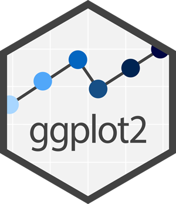
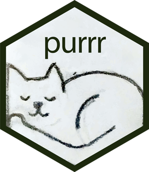
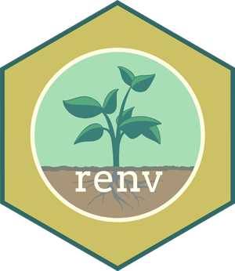

Cette page regroupe les aide-mémoire, la documentation et les outils utiles pour le cours.

## Aide-mémoire R {#aide-memoire-r}

```{=html}
<div class="cheatsheet-intro">
  <div>
    <p class="cheatsheet-lead">Les essentiels de R, à portée de main.</p>
    <p class="cheatsheet-hint">Une sélection de fiches synthèses (« cheat sheets ») à garder près de soi pendant les exercices. Choisissez une tâche, puis ouvrez son PDF.</p>
  </div>
  <div class="cheatsheet-motif" aria-hidden="true">
    
    
    
  </div>
</div>
```

### À garder sous la main

Les premières fiches à consulter pour les manipulations de données, les graphiques et les rapports du cours.

```{=html}
<div class="cheatsheet-grid">
<article class="cheatsheet-card" aria-labelledby="fiche-r-base">
  <div class="cheatsheet-card-header">
    <span class="cheatsheet-r-frame"></span>
    <div><h4 id="fiche-r-base">R de base</h4><p class="cheatsheet-purpose">Les premiers réflexes</p></div>
  </div>
  <p class="cheatsheet-description">Vecteurs, indexation, matrices et fonctions usuelles.</p>
  <div class="cheatsheet-functions"><code>c()</code><code>seq()</code><code>mean()</code></div>
  <div class="cheatsheet-actions">
    <a class="cheatsheet-pdf" href="https://rstudio.github.io/cheatsheets/base-r.pdf" aria-label="R de base : ouvrir le PDF en anglais">PDF · EN</a>
  </div>
</article>
<article class="cheatsheet-card" aria-labelledby="fiche-readr">
  <div class="cheatsheet-card-header">
    
    <div><h4 id="fiche-readr">readr</h4><p class="cheatsheet-purpose">Importer les données</p></div>
  </div>
  <p class="cheatsheet-description">Lire des fichiers CSV et choisir les types de colonnes. La fiche couvre aussi readxl.</p>
  <div class="cheatsheet-functions"><code>read_csv()</code><code>col_types</code></div>
  <div class="cheatsheet-actions">
    <a class="cheatsheet-pdf" href="https://rstudio.github.io/cheatsheets/data-import.pdf" aria-label="readr : ouvrir le PDF en anglais">PDF · EN</a>
  </div>
</article>
<article class="cheatsheet-card" aria-labelledby="fiche-dplyr">
  <div class="cheatsheet-card-header">
    
    <div><h4 id="fiche-dplyr">dplyr</h4><p class="cheatsheet-purpose">Transformer et résumer</p></div>
  </div>
  <p class="cheatsheet-description">Filtrer, créer des variables, résumer par groupe et joindre des tables.</p>
  <div class="cheatsheet-functions"><code>filter()</code><code>mutate()</code><code>summarise()</code></div>
  <div class="cheatsheet-actions">
    <a class="cheatsheet-pdf" href="https://rstudio.github.io/cheatsheets/data-transformation.pdf" aria-label="dplyr : ouvrir le PDF en anglais">PDF · EN</a>
  </div>
</article>
<article class="cheatsheet-card" aria-labelledby="fiche-tidyr">
  <div class="cheatsheet-card-header">
    
    <div><h4 id="fiche-tidyr">tidyr</h4><p class="cheatsheet-purpose">Organiser les tableaux</p></div>
  </div>
  <p class="cheatsheet-description">Passer du format large au format long et traiter les valeurs manquantes.</p>
  <div class="cheatsheet-functions"><code>pivot_longer()</code><code>replace_na()</code></div>
  <div class="cheatsheet-actions">
    <a class="cheatsheet-pdf" href="https://rstudio.github.io/cheatsheets/tidyr.pdf" aria-label="tidyr : ouvrir le PDF en anglais">PDF · EN</a>
  </div>
</article>
<article class="cheatsheet-card" aria-labelledby="fiche-ggplot2">
  <div class="cheatsheet-card-header">
    
    <div><h4 id="fiche-ggplot2">ggplot2</h4><p class="cheatsheet-purpose">Visualiser les données</p></div>
  </div>
  <p class="cheatsheet-description">Choisir une géométrie, régler les axes et composer un graphique lisible.</p>
  <div class="cheatsheet-functions"><code>aes()</code><code>geom_point()</code><code>facet_wrap()</code></div>
  <div class="cheatsheet-actions">
    <a class="cheatsheet-pdf" href="https://rstudio.github.io/cheatsheets/data-visualization.pdf" aria-label="ggplot2 : ouvrir le PDF en anglais">PDF · EN</a>
    <a class="cheatsheet-translation" href="https://rstudio.github.io/cheatsheets/translations/french/data-visualization_fr.pdf" aria-label="ggplot2 : traduction française en PDF">PDF français</a>
  </div>
</article>
<article class="cheatsheet-card" aria-labelledby="fiche-quarto">
  <div class="cheatsheet-card-header">
    
    <div><h4 id="fiche-quarto">Quarto</h4><p class="cheatsheet-purpose">Rédiger et partager</p></div>
  </div>
  <p class="cheatsheet-description">Retrouver la syntaxe Markdown, les blocs de code et les options des rapports.</p>
  <div class="cheatsheet-functions"><code>YAML</code><code>blocs de code</code><code>rendu</code></div>
  <div class="cheatsheet-actions">
    <a class="cheatsheet-pdf" href="https://rstudio.github.io/cheatsheets/quarto.pdf" aria-label="Quarto : ouvrir le PDF en anglais">PDF · EN</a>
  </div>
</article>
</div>
```

### Selon vos besoins

Texte, catégories, dates, itérations et environnement de travail.

```{=html}
<div class="cheatsheet-grid">
<article class="cheatsheet-card" aria-labelledby="fiche-stringr">
  <div class="cheatsheet-card-header">
    
    <div><h4 id="fiche-stringr">stringr</h4><p class="cheatsheet-purpose">Manipuler le texte</p></div>
  </div>
  <p class="cheatsheet-description">Repérer des motifs, extraire du texte et remplacer des caractères.</p>
  <div class="cheatsheet-functions"><code>str_detect()</code><code>str_replace()</code></div>
  <div class="cheatsheet-actions">
    <a class="cheatsheet-pdf" href="https://rstudio.github.io/cheatsheets/strings.pdf" aria-label="stringr : ouvrir le PDF en anglais">PDF · EN</a>
  </div>
</article>
<article class="cheatsheet-card" aria-labelledby="fiche-forcats">
  <div class="cheatsheet-card-header">
    
    <div><h4 id="fiche-forcats">forcats</h4><p class="cheatsheet-purpose">Gérer les facteurs</p></div>
  </div>
  <p class="cheatsheet-description">Réordonner les catégories et regrouper des modalités.</p>
  <div class="cheatsheet-functions"><code>fct_reorder()</code><code>fct_relevel()</code></div>
  <div class="cheatsheet-actions">
    <a class="cheatsheet-pdf" href="https://rstudio.github.io/cheatsheets/factors.pdf" aria-label="forcats : ouvrir le PDF en anglais">PDF · EN</a>
  </div>
</article>
<article class="cheatsheet-card" aria-labelledby="fiche-lubridate">
  <div class="cheatsheet-card-header">
    
    <div><h4 id="fiche-lubridate">lubridate</h4><p class="cheatsheet-purpose">Travailler avec les dates</p></div>
  </div>
  <p class="cheatsheet-description">Lire les dates et manipuler les composantes du calendrier et les durées.</p>
  <div class="cheatsheet-functions"><code>ymd()</code><code>year()</code><code>interval()</code></div>
  <div class="cheatsheet-actions">
    <a class="cheatsheet-pdf" href="https://rstudio.github.io/cheatsheets/lubridate.pdf" aria-label="lubridate : ouvrir le PDF en anglais">PDF · EN</a>
  </div>
</article>
<article class="cheatsheet-card" aria-labelledby="fiche-purrr">
  <div class="cheatsheet-card-header">
    
    <div><h4 id="fiche-purrr">purrr</h4><p class="cheatsheet-purpose">Répéter avec des fonctions</p></div>
  </div>
  <p class="cheatsheet-description">Appliquer une fonction à plusieurs éléments et travailler avec les listes.</p>
  <div class="cheatsheet-functions"><code>map()</code><code>map_dbl()</code><code>walk()</code></div>
  <div class="cheatsheet-actions">
    <a class="cheatsheet-pdf" href="https://rstudio.github.io/cheatsheets/purrr.pdf" aria-label="purrr : ouvrir le PDF en anglais">PDF · EN</a>
  </div>
</article>
<article class="cheatsheet-card" aria-labelledby="fiche-renv">
  <div class="cheatsheet-card-header">
    
    <div><h4 id="fiche-renv">renv</h4><p class="cheatsheet-purpose">Reproduire un projet</p></div>
  </div>
  <p class="cheatsheet-description">Enregistrer les versions des packages et restaurer un environnement R.</p>
  <div class="cheatsheet-functions"><code>init()</code><code>snapshot()</code><code>restore()</code></div>
  <div class="cheatsheet-actions">
    <a class="cheatsheet-pdf" href="https://rstudio.github.io/cheatsheets/renv.pdf" aria-label="renv : ouvrir le PDF en anglais">PDF · EN</a>
  </div>
</article>
<article class="cheatsheet-card" aria-labelledby="fiche-rstudio">
  <div class="cheatsheet-card-header">
    
    <div><h4 id="fiche-rstudio">RStudio</h4><p class="cheatsheet-purpose">Maîtriser son environnement</p></div>
  </div>
  <p class="cheatsheet-description">Retrouver les panneaux, les raccourcis et les outils de développement.</p>
  <div class="cheatsheet-functions"><code>projets</code><code>raccourcis</code><code>débogage</code></div>
  <div class="cheatsheet-actions">
    <a class="cheatsheet-pdf" href="https://rstudio.github.io/cheatsheets/rstudio-ide.pdf" aria-label="RStudio : ouvrir le PDF en anglais">PDF · EN</a>
    <a class="cheatsheet-translation" href="https://rstudio.github.io/cheatsheets/translations/french/rstudio-ide_fr.pdf" aria-label="RStudio : traduction française en PDF">PDF français</a>
  </div>
</article>
</div>
```

### Pour les autres outils du cours

- [R Markdown : syntaxe et rapports (PDF, anglais)](https://rstudio.github.io/cheatsheets/rmarkdown.pdf).
- [Développement de packages : devtools, roxygen2 et tests avec testthat (PDF, anglais)](https://rstudio.github.io/cheatsheets/package-development.pdf).
- [tidymodels : les étapes de la modélisation (PDF, anglais)](https://rstudio.github.io/cheatsheets/ml-tidymodels.pdf).
- [Shiny : les applications interactives (PDF, anglais)](https://rstudio.github.io/cheatsheets/shiny.pdf).
- [Positron : l'environnement de développement (PDF, anglais)](https://rstudio.github.io/cheatsheets/positron.pdf).

::: {.cheatsheet-notes}
Les liens mènent directement aux PDF du [catalogue Posit](https://rstudio.github.io/cheatsheets/). « EN » indique l'anglais; les liens « PDF français » donnent accès aux traductions communautaires, dont la version peut différer. Pour une explication pas à pas, consultez la [mise à niveau R](ressources/mise-a-niveau-r.qmd) et les [lectures du cours](lectures.qmd).

Sources : Posit et les auteurs des fiches, catalogue consulté le 23 septembre 2026. Logos hexagonaux : [Posit / RStudio, CC0](https://github.com/rstudio/hex-stickers). Logo R : [R Foundation, 2016, CC BY-SA 4.0](https://www.r-project.org/logo/), reproduit sans modification. Les fiches et les logos conservent leurs licences respectives.
:::


## R et environnement

- [R](https://cran.r-project.org/).
- [Positron](https://positron.posit.co/download.html).
- [RStudio Desktop](https://posit.co/downloads/).
- [Quarto](https://quarto.org/docs/get-started/).
- [Git](https://git-scm.com/install/).
- [GitHub](https://github.com/).

## Programmation et science des données

- [tidyverse](https://www.tidyverse.org/).
- [ggplot2](https://ggplot2.tidyverse.org/).
- [tidymodels](https://www.tidymodels.org/).
- [Shiny](https://shiny.posit.co/).
- [testthat](https://testthat.r-lib.org/).
- [renv](https://rstudio.github.io/renv/).

## Ressources du cours

- [Démarrage](demarrage.qmd)
- [Installation et vérification technique](installation.qmd)
- [Données autorisées](donnees.qmd)
- [Dépendances R](dependances.qmd)
- [Soutien technique](soutien-technique.qmd)
- [Politique IA](ia.qmd)
- [Gabarit des mini-tests de préparation](gabarits/gabarit-mini-test-preparation.qmd)
- [Rattrapage R pour le défi technique 1](ressources/rattrapage-r-git-defi-1.qmd)

## Liens de référence

- R for Data Science, 2e édition: <https://r4ds.hadley.nz/>
- Documentation officielle `readr`: <https://readr.tidyverse.org/>
- Documentation officielle `dplyr`: <https://dplyr.tidyverse.org/>
- Documentation officielle `stringr`: <https://stringr.tidyverse.org/>
- Happy Git and GitHub for the useR: <https://happygitwithr.com/>
